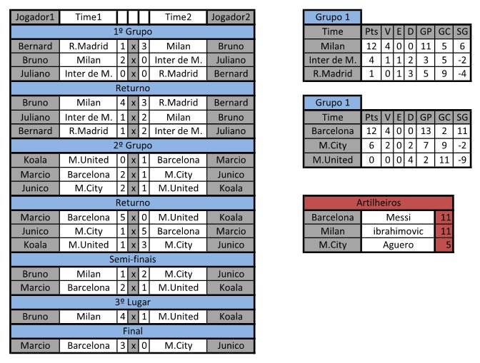
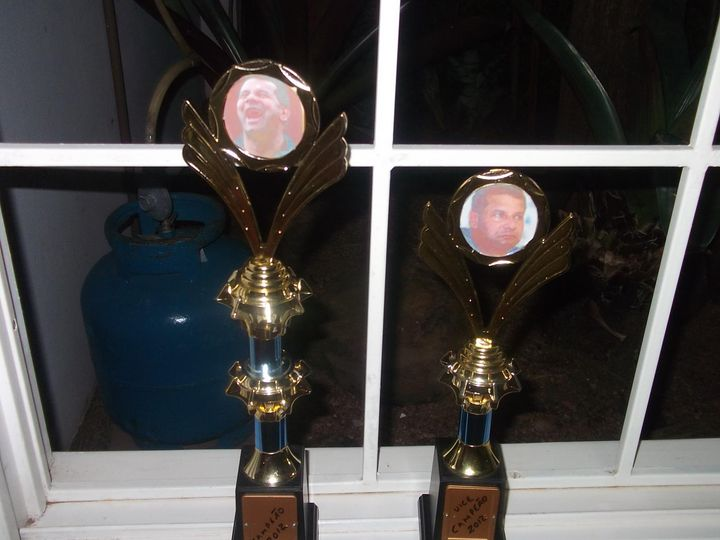
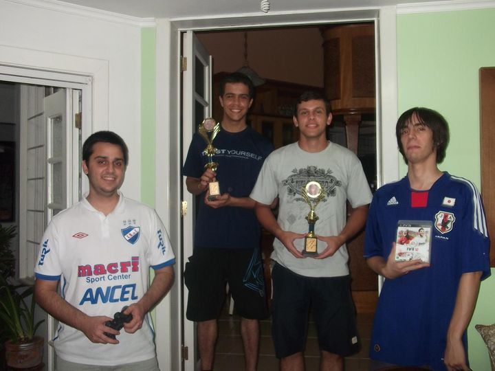
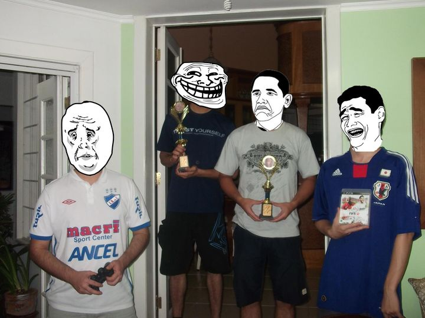

# Copa Cautela: 1ª edição

## Setup

Jogo: Fifa 12  
Data: 16/03/2012 
Local: Mansão dos Bittarellos  

## Fase de grupos

<table>
<thead>
  <tr>
    <th colspan="5" align="center">Grupo 1</th>
    <th></th>
    <th colspan="5" align="center">Grupo 2</th>
  </tr>
  <tr>
    <th>Jogador</th>
    <th>Time</th>
    <th>Placar</th>
    <th>Time</th>
    <th>Jogador</th>
    <th></th>
    <th>Jogador</th>
    <th>Time</th>
    <th>Placar</th>
    <th>Time</th>
    <th>Jogador</th>
  </tr>
  </thead>
<tbody align="center">
  <tr>
    <td>Bernard</td>
    <td></td>
    <td>1 x <b>3</b></td>
    <td></td>
    <td><b>Bruno</b></td>
    <td></td>
    <!-- Group 2 -->
    <td>Rogério</td>
    <td></td>
    <td>0 x <b>1</b></td>
    <td></td>
    <td><b>Márcio</b></td>
  </tr>
  <tr>
    <td><b>Bruno</b></td>
    <td></td>
    <td><b>2</b> x 0</td>
    <td></td>
    <td>Juliano</td>
    <td></td>
    <!-- Group 2 -->
    <td><b>Márcio</b></td>
    <td></td>
    <td><b>2</b> x 1</td>
    <td></td>
    <td>Junico</td>
  </tr>
  <tr>
    <td>Juliano</td>
    <td></td>
    <td>0 x 0</td>
    <td></td>
    <td>Bernard</td>
    <td></td>
    <!-- Group 2 -->
    <td><b>Junico</b></td>
    <td></td>
    <td><b>2</b> x 1</td>
    <td></td>
    <td>Rogério</td>
  </tr>
  <tr>
    <th colspan="5" align="center">Returno</th>
    <th></th>
    <th colspan="5" align="center">Returno</th>
  </tr>

  <tr>
    <td><b>Bruno</b></td>
    <td></td>
    <td><b>4</b> x 3</td>
    <td></td>
    <td>Bernard</td>
    <td></td>
    <!-- Group 2 -->
    <td><b>Márcio</b></td>
    <td></td>
    <td><b>5</b> x 0</td>
    <td></td>
    <td>Rogério</td>
  </tr>
  <tr>
    <td>Juliano</td>
    <td></td>
    <td>1 x <b>2</b></td>
    <td></td>
    <td><b>Bruno</b></td>
    <td></td>
    <!-- Group 2 -->
    <td>Junico</td>
    <td></td>
    <td>1 x <b>5</b></td>
    <td></td>
    <td><b>Márcio</b></td>
  </tr>
  <tr>
    <td>Bernard</td>
    <td></td>
    <td>1 x <b>2</b></td>
    <td></td>
    <td><b>Juliano</b></td>
    <td></td>
    <!-- Group 2 -->
    <td>Rogério</td>
    <td></td>
    <td>1 x <b>3</b></td>
    <td></td>
    <td><b>Junico</b></td>
  </tr>

</tbody>
</table>

## Classificação

<table>
<thead>
  <tr>
    <th colspan="9" align="center">Grupo 1</th>
  </tr>
  <tr>
    <th>Jogador</th>
    <th>Time</th>
    <th>Pts</th>
    <th>V</th>
    <th>E</th>
    <th>D</th>
    <th>GP</th>
    <th>GC</th>
    <th>GS</th>
  </tr>
</thead>
<tbody align="center">
  <tr>
    <td>Bruno</td>
    <td></td>
    <td>12</td>
    <td>4</td>
    <td>0</td>
    <td>0</td>
    <td>11</td>
    <td>5</td>
    <td>6</td>
  </tr>
  <tr>
    <td>Juliano</td>
    <td></td>
    <td>4</td>
    <td>1</td>
    <td>1</td>
    <td>2</td>
    <td>3</td>
    <td>5</td>
    <td>-2</td>
  </tr>
  <tr>
    <td>Bernard</td>
    <td></td>
    <td>1</td>
    <td>0</td>
    <td>1</td>
    <td>3</td>
    <td>5</td>
    <td>9</td>
    <td>-4</td>
  </tr>
  <tr>
    <th colspan="9" align="center">Grupo 2</th>
  </tr>
  <tr>
    <th>Jogador</th>
    <th>Time</th>
    <th>Pts</th>
    <th>V</th>
    <th>E</th>
    <th>D</th>
    <th>GP</th>
    <th>GC</th>
    <th>GS</th>
  </tr>
  <tr>
    <td>Márcio</td>
    <td></td>
    <td>12</td>
    <td>4</td>
    <td>0</td>
    <td>0</td>
    <td>13</td>
    <td>2</td>
    <td>11</td>
  </tr>
  <tr>
    <td>Junico</td>
    <td></td>
    <td>6</td>
    <td>2</td>
    <td>0</td>
    <td>2</td>
    <td>7</td>
    <td>9</td>
    <td>-2</td>
  </tr>
  <tr>
    <td>Rogério</td>
    <td></td>
    <td>0</td>
    <td>0</td>
    <td>0</td>
    <td>4</td>
    <td>2</td>
    <td>11</td>
    <td>-9</td>
  </tr>
</tbody>
</table>

## Mata-mata

Juliano teve que sair. No lugar dele foi posto o Rogério

<table>
<tbody>
  <tr>
    <td colspan="11" align="center"><h3>Semifinais</h3></td>
  </tr>
  <tr>
    <td>Bruno</td>
    <td></td>
    <td>1 x <b>2</b></td>
    <td></td>
    <td><b>Junico</b></td>
    <td />
    <!-- Group 2 -->
    <td><b>Márcio</b></td>
    <td></td>
    <td><b>2</b> x 1</td>
    <td></td>
    <td>Rogério</td>
  </tr>
  <tr>
    <td colspan="11" align="center"><h3>3º Lugar</h3></td>
  </tr>
  <tr colspan="11" align="center">
    <td colspan="11" align="center">
      <table align="center">
      <tbody>
        <tr>
          <td><b>Bruno</b></td>
          <td></td>
          <td><b>4</b> x 1</td>
          <td></td>
    <td>Rogério</td>
        </tr>
      </tbody>
      </table>
    </td>
  </tr>
  <tr>
    <td colspan="11" align="center"><h3>Final</h3></td>
  </tr>
  <tr colspan="11" align="center">
    <td colspan="11" align="center">
      <table align="center">
      <tbody>
        <tr>
          <td>Márcio</td>
          <td></td>
          <td><b>3</b> x 0</td>
          <td></td>
          <td>Junico</b></td>
        </tr>
      </tbody>
      </table>
    </td>
  </tr>
</tbody>
</table>

## Artilheiros

<table>
<thead>
  <tr>
    <th>Jogador</th>
    <th>Time</th>
    <th>Atleta</th>
    <th>Gols</th>
  </tr>
</thead>
<tbody align="center">
  <tr>
    <td>Márcio</td>
    <td></td>
    <td>Messi</td>
    <td>11</td>
  </tr>
  <tr>
    <td>Bruno</td>
    <td></td>
    <td>Ibrahimovic</td>
    <td>11</td>
  </tr>
  <tr>
    <td>Junico</td>
    <td></td>
    <td>Aguero</td>
    <td>5</td>
  </tr>
</tbody>
</table>

---------------------------------------------

## Midia

