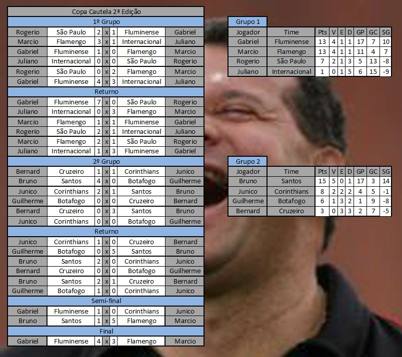

# Copa Cautela: 2ª edição

## Setup

Jogo: Fifa 12  
Data:  
Local:  

## Fase de grupos

<table>
<thead>
  <tr>
    <th colspan="5" align="center">Grupo 1</th>
    <th></th>
    <th colspan="5" align="center">Grupo 2</th>
  </tr>
  <tr>
    <th>Jogador</th>
    <th>Time</th>
    <th>Placar</th>
    <th>Time</th>
    <th>Jogador</th>
    <th></th>
    <th>Jogador</th>
    <th>Time</th>
    <th>Placar</th>
    <th>Time</th>
    <th>Jogador</th>
  </tr>
  </thead>
<tbody align="center">
  <tr>
    <td><b>Rogério</b></td>
    <td></td>
    <td><b>2</b> x 1</td>
    <td></td>
    <td>Gabriel</td>
    <td></td>
    <td>Bernard</td>
    <td></td>
    <td>1 x 1</td>
    <td></td>
    <td>Junico</td>
  </tr>
  <tr>
    <td><b>Márcio<b></td>
    <td></td>
    <td><b>3</b> x 1</td>
    <td></td>
    <td>Juliano</td>
    <td />
    <td><b>Bruno<b></td>
    <td></td>
    <td><b>4</b> x 0</td>
    <td></td>
    <td>Neis</td>
  </tr>
  <tr>
    <td><b>Gabriel</b></td>
    <td></td>
    <td><b>1</b> x 0</td>
    <td></td>
    <td>Márcio</td>
    <td />
    <td><b>Junico</b></td>
    <td></td>
    <td><b>2</b> x 1</td>
    <td></td>
    <td>Bruno</td>
  </tr>
  <tr>
    <td>Juliano</td>
    <td></td>
    <td>0 x 0</td>
    <td></td>
    <td>Rogério</td>
    <td />
    <td>Neis</td>
    <td></td>
    <td>0 x 0</td>
    <td></td>
    <td>Bernard</td>
  </tr>
  <tr>
    <td color="red">Rogério</td>
    <td></td>
    <td>0 x <b>2</b></td>
    <td></td>
    <td><b>Márcio</b></td>
    <td />
    <!-- Group 2 -->
    <td>Bernard</td>
    <td></td>
    <td>0 x <b>3</b></td>
    <td></td>
    <td><b>Bruno</b></td>
  </tr>
  <tr>
    <td><b>Gabriel<b></td>
    <td></td>
    <td><b>4</b> x 3</td>
    <td></td>
    <td>Juliano</td>
    <td />
    <!-- Group 2 -->
    <td>Junico</td>
    <td></td>
    <td>0 x 0</td>
    <td></td>
    <td>Neis</td>
  </tr>

  <tr>
    <th colspan="5" align="center">Returno</th>
    <th></th>
    <th colspan="5" align="center">Returno</th>
  </tr>

  <tr>
    <td><b>Gabriel<b></td>
    <td></td>
    <td><b>7</b> x 0</td>
    <td></td>
    <td>Rogério</td>
    <td />
    <!-- Group 2 -->
    <td><b>Junico</b></td>
    <td></td>
    <td><b>1</b> x 0</td>
    <td></td>
    <td>Bernard</td>
  </tr>
  <tr>
    <td>Juliano</td>
    <td></td>
    <td>0 x <b>3</b></td>
    <td></td>
    <td><b>Márcio</b></td>
    <td />
    <!-- Group 2 -->
    <td>Neis</td>
    <td></td>
    <td>0 x <b>5</b></td>
    <td></td>
    <td><b>Bruno</b></td>
  </tr>
  <tr>
    <td>Márcio</td>
    <td></td>
    <td>1 x 1</td>
    <td></td>
    <td>Gabriel</td>
    <td />
    <!-- Group 2 -->
    <td><b>Bruno</b></td>
    <td></td>
    <td><b>2</b> x 0</td>
    <td></td>
    <td>Junico</td>
  </tr>
  <tr>
    <td><b>Rogério</b></td>
    <td></td>
    <td><b>2</b> x 1</td>
    <td></td>
    <td>Juliano</td>
    <td />
    <!-- Group 2 -->
    <td>Bernard</td>
    <td></td>
    <td>0 x 0</td>
    <td></td>
    <td>Neis</td>
  </tr>
  <tr>
    <td><b>Márcio</b></td>
    <td></td>
    <td><b>2</b> x 1</td>
    <td></td>
    <td>Rogério</td>
    <td />
    <!-- Group 2 -->
    <td><b>Bruno</b></td>
    <td></td>
    <td><b>2</b> x 1</td>
    <td></td>
    <td>Bernard</td>
  </tr>
  <tr>
    <td>Juliano</td>
    <td></td>
    <td>1 x <b>3</b></td>
    <td></td>
    <td><b>Gabriel<b></td>
    <td />
    <!-- Group 2 -->
    <td><b>Neis</b></td>
    <td></td>
    <td><b>1</b> x 0</td>
    <td></td>
    <td>Junico</td>
  </tr>
</tbody>
</table>

## Mata-mata

<table>
<tbody>
  <tr>
    <td colspan="11" align="center"><h3>Semifinais</h3></td>
  </tr>
  <tr>
    <td><b>Gabirel</b></td>
    <td></td>
    <td><b>1</b> x 0</td>
    <td></td>
    <td>Junico</td>
    <td />
    <!-- Group 2 -->
    <td>Bruno</td>
    <td></td>
    <td>1 x <b>5</b></td>
    <td></td>
    <td><b>Márcio</b></td>
  </tr>  
  <tr>
    <td colspan="11" align="center"><h3>Final</h3></td>
  </tr>
  <tr colspan="11" align="center">
    <td colspan="11" align="center">
      <table align="center">
      <tbody>
        <tr>
          <td><b>Gabirel</b></td>
          <td></td>
          <td><b>4</b> x 3</td>
          <td></td>
          <td><b>Márcio</b></td>
        </tr>
      </tbody>
      </table>
    </td>
  </tr>
</tbody>
</table>

---------------------------------------------

## Midia

